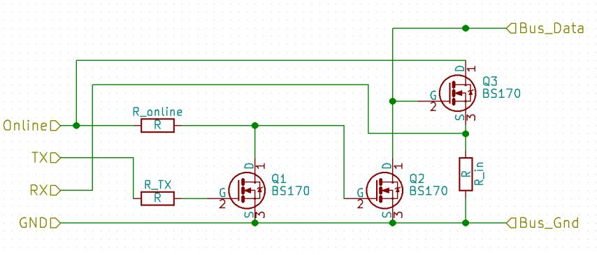

# UARTBus and infrastructure

## Goal of the project
The project goal is to connect microcontrollers together on wire at minimal
cost (wiring, external peripheral components) and build a decentralized
sensor-actuator network where the node's can interact with each other and 
the microcontroller's software can be upgraded from the bus. This bus should be
connectable to a computer system (Desktop/Server PC, Raspberry PI, etc) to
achieve complex controlling by interacting with the sensors, actuators with
higher level softwares.

## Solution

The way to satisfy these requirement is to design and implement:
  
- new bus system for microcontrollers based on UART peripheral,
- lightweight RPC library for microcontrollers,
- bus connector for computers,
- so called "host program" that implements common functionalities and manages
	application upload into the microcontroller. 
- a utility to connect softwares to the bus (through bus connector)
- a higher level representation of bus devices (implemented in java)

## Feature list:

** Features related to bus: **

- microcontrollers connected together using built in UART peripheral and only
	one (pair when no ground) wire
- The bus forms a node based (device with address) network, but can be used
	to construct message based network like CAN.
- This is a multi master bus: any node can send message to any other node and
	vica-versa.
- Supports broadcast messages and that way device groups (negative device 
	addresses).
- Handles transmission collisions, retransmit and has a simple anti flood
	protection
- Interrupt based packet receive (send happens in blocking mode for now)
- Packet transmission based on transmission/idle time slots
- The core (ub) library is designed to be device agnostic and can even connect
	to multiple bus at same time when there's more UART peripheral available.
- The project contains a small footprint RPC library with function namespace
	capability used to order functions into namespaces like in OOP languages.
- variable length addressing

** Features related to the infrastructure: **

- The project contains a so called 'uart bootloader' (that's a wrong name, it
	should be host application or something else) that implements basic
	functionalities and code upload capability. Of course applications written
	directly for the microcontroller won't work, but i've created an
	`app_wrapper` used to compile applications can be uploaded to a node.
	TODO compiler, source, etc
- The project contains a bus connector source written for ATMega2560, used to
	connect PC to an UARTBus.
- Java: At the PC side there's a server application (written in java) that makes
	the bus available through a JSON RPC server, this makes possible multiple PC
	application to connect the bus simultaneously even for different languages.
- Java: CLI application: `ping` to ping nodes, `console` to send command to
	devices, `packetloss` to measure packet loss ratio between bus connector
	and node, `collisionPacketloss` to measure packet loss and duplication
	when send a broadcast packets that results race to access the bus.
	`upload` upload application code to a device with has uartbus bootloader on
	the board.

## Example usage

TODO: There's an easier way to try it out by yourself, using only arduino
and generic FETs (or BJTs with no opening delay in switching mode)

## Documentation

See: [Documentation index](./doc/index.md)   
All level and detail are implemented as small portion and bound so loosely
together to anyone can reuse the smaller piece of building blocks for custom
project.  

Eg: you can use OSI-{1,2} levels and skip the upper ones and
create a message based bus like as the CAN bus works. Or reverse: use CAN on the
lowest level and use the infrastructure.

## Short implementation explanation

### OSI-1: Physical layer

The bus data line consist of one wire pulled up to the bus Vcc voltage.
This line can be pulled down by any node used to transfer data.

The microcontroller's UART port is connected to the bus using bus driver: 

(During the development: Vcc = 12V; Rbus = 500Ω; Rtx = 0Ω; 
Rin & Ronline = 10 KΩ; 120m twisted pair for GND and Bus wire; 115,2 kbps)
(Note: this BS170 tolerates ±20V of Ugs voltage so can be connected directly to
the bus wire, but this might be risky when dealing with high transient voltage.
Solution: Connect TVS diode between `Bus` and `GND` wire. See documentation)

This is a simple level driver which makes the byte sent on the TX port appears
in the `Bus` line and data appears on the `Bus` wire translated to the RX port
with the proper logic level. This also means what we send on the TX we receive
on the RX. This used for transmission error and collision detection.

- Channel 1, Red: Bus wire signal 2 V/Div 
- Channel 2, Yellow: RX wire signal 1 V/Div

### OSI-2: Datalink layer

In this context, packet is interpreted as a sequence of byte in a time frame.
The time frame starts at the first sent byte and ends after the time of 2
(default value, but configurable) byte time transmission idle period.

A demonstration of UARTBus packages with collision handling (and retransmission)
using two nodes plus one bus connector.
(This is an early development oscillogramm, timing not properly optimized)

- Channel 1, Red: Bus wire signal 2 V/Div 
- Channel 2, Yellow: RX wire signal of the first device 1 V/Div

1) Bus connector sends a broadcast ping packet
2) Collision occurred, both node cancels the transmission and step back for a
	random time (longer wait time to the next transmission start)
	(Ethernets style collision handling)
3) First node "wins the arbitration" and sends the response pong packet
4) Second node also retransmit the pong packet that collided previously
5) No packet to send. Back to idle state.

### OSI-3: Network layer

Every node receives every packets on bus. This makes possible to create
broadcast addresses (0 is a general broadcast address) and device groups by
using negative addresses for this purpose.

Instead of using fixed int{8,16,32,64}_t for addressing, i've created a so
called variable length addressing:

- If we choose int8_t, every packet has only two byte of overhead at the
	addressing, but only 128 group 1 broadcast and 127 device address available.
- If we choose int32_t, every packet has 8 byte overhead, but addresses can go
	at group to 2_147_483_648, one broadcast and 2_147_483_647 device address.

To balance between this extreme cases i've created an encoder/decoder that
enables short address bytes when addresses are low (between -64 and +63) and 
increase address length when assign higher addresses.

|   | 7. bit | 6. bit | 5. bit | 4. bit | 3. bit | 2. bit | 1. bit | 0. bit |  
| --- |:---:|:---:|:---:|:---:|:---:|:---:|:---:|:---:|  
| First byte | E | S | A5 | A4 | A3 | A2 | A1 | A0 |  
| Nth byte | E | A6 | A5 | A4 | A3 | A2 | A1 | A0 |  

Byte scheme:

- E: Extend: Address continued on the next byte. The in last address byte this
	bit is 0. 
- S: Signum: sign of the whole number. Used only in the first byte. If set
	address is converted as: -(addr+1)
- An: address bit.

Example for one byte addresses:

| Address | First byte |  
|:---:|:---:|  
| 0   | 0000_0000 |  
| -1  | 0100_0000 |  
| 16  | 0001_0000 |  
| -16 | 0100_1111 |  
| -64 | 0111_1111 |  
| 63  | 0011_1111 |  

Example for two byte addresses:

| Address | First byte | Second byte |  
|:---:|:---:|:---:|
| 128   | 1000_0001 | 0000_0000 |  
| -128  | 1100_0000 | 0111_1111 |  
| 8191  | 1011_1111 | 0111_1111 |  
| -8192 | 1111_1111 | 0111_1111 |  

These types described as (s)vint_t (signed variable int) but it is not a real
type which the compiler knows, just a notation. (There's an implementation for
uvint_t if you use only unsigned values.)

The default packet scheme of the project:

- svint_t destination address
- svint_t source address
- uint8_t[n] payload
- uint8_t crc8 packet checksum

### OSI-{4,5}: Transport and Session layer
All packets are datagrams. There's no transmission control mechanism implemented
__yet__.

### OSI-6: Presentation layer

I've created a small footprint RPC library for microcontrollers. The
namespace path and function parameters just placement in the packet after each
other. The dispatcher function relays the request to the proper RPC path, and
the registered RPC call handler extracts the parameters executes the query and
responses the packet.

A request parsed into a `struct rpc_request` located in
[./source/uc/utils/lib/rpc/rpc.h](./source/uc/utils/lib/rpc/rpc.h).  

This request is dispatched through a RPC namespace chain. For example see:
[./source/uc/bootloader/ub_bootloader.c](./source/uc/bootloader/ub_bootloader.c)
how RPC_NS_FUNCTIONS constructed and where this chain used as a parameter.

When a namespace matched `procPtr` incremented, so in next processing stage
the it will be continued from the next byte (pointed in the payload by
the procPtr which is incremented right now)

The pointed function may dispatch again, or it can be a function which processes
the request. The `reply` function pointer in the `struct rpc_request` used
assemble and send response packet.

Example: in the bootloader (aka: uart host application) there's some pre-defined
RPC namespace and functions which provides unified functionality for all devices
on the bus.

- 0: the 0.th namespace is reserved for response packets.
- 1: Bus functions
	- 0 ping: responses and empty message as a pong packet
	- 1 replay: responses the request payload
	- 2 user_led: controls the PORTB5 LED (arduino 13 port led) 0 = off, 1 = on,
		2 = toggle: always replays the current (after the request) state of the
		led
- 2: Bootloader functions:
	- 0 power functions:
		- 0 hardware reset (using wdt timeout)
		- 1 software reset (jmp 0x0)
	...
	- 4: flash functions:
		- getFlashStage: is the device under code upload?
		- getAppStartAddress: returns the application start address
		....
		
And so on, for full namespace specification see documentation.

To turn on the user led you have to send a packet with payload of:    
1:2:1 => (1) Bus functions => (2) user led handler function => (1) parameter    
this returns with the response:    
0:1:2:1 => (0) response packet => (1:2) namespace and function path => (1)
	response parameter aka the led is turned on.   
   
   
To invoke a hardware reset:
2:0:0 => (2) Bootloader functions => (0) power functions => (0) hardware reset   
No response generated, because committed a hardware reset immediately.

This namespace tree is extendible to any depth, and designed to the application
developer can attach new function into this tree.

At the other side, on the PC in java, this RPC namespace tree is modeled with
objects, see: `UartBusDevice.getRpcRoot()` . But the best thing: i've created
a mechanism to describe interfaces for this RPC namespaces and functions with
the known types, and java (using proxies) generates namespace object and
function you can call right from java. For example see: UbBootloaderFunctions
and for a real application that uses this see: UartbusCodeUploader

### OSI-7: Application level

In the directory .source/uc/bootloader/ you find the source of the bootloader
(the naming is wrong, it's more likely be called as uart host application)
This implements the basic unified functionality described earlier and also makes
possible to manage application code upload.

