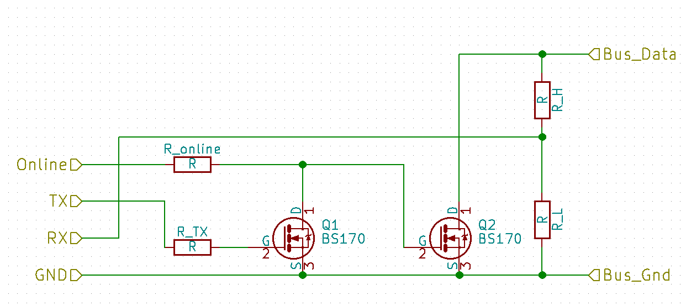

# UARTBus OSI-1: Physical layer

## Physical layer connection frame

i.e.: How the nodes connected together?

At the signaling level, the minimal requirement is to have a common physical
phenomenon what multiple node can affect and which have a dominant and recessive
state. When multiple node at the same time trying to push information to the
physical layer, any and even one dominant state can override any even more
recessive state (like in CAN systems).

eg.:  

- Pull-up data rail: any node can short circuit the rail to drive the to
	low logical voltage. In this case the recessive: high logical voltage,
	the dominant: low logical voltage. This is the default physical layer 
	i used on the project developement.
- Plain data rail: any node can power up the rail. Recessive: no voltage on
	the rail. Dominant: voltage on the rail.
- Plain light: Nodes connected together using LEDs and Photovoltaic cells
	or IR sender/receivers. Recessive: no light. Dominant: light emitted. 
- Modulated sound: Recessive: no sound emitted, Dominant: 30 KHz sound emitted.

The signal what the node emits should be detectable for all other node, and also
for the sender. This loopback used 

## Pull-up data rail

The UARTbus originally is designed to connect nodes using only one wire
(or one pair) which is pulled up with a resistor R_bus to a maximal U_bus_max
voltage.

The bus data line consist of one wire pulled up to the bus Vcc voltage.
This line can be pulled down by any node used to transfer data.

Every pull-up bus driver circuit should fit into this fixture:  

### Design requirements of the bus driver

- Fit to the microcontrollers logical voltage levels.
- Fit to various U_bus_max voltage.
- Allow high speed transfer 
- Overvoltage (bus and node side)
- Overcurrent protection (bus wire stucks to Vcc)
- Node failure protection (broken node can't block the bus)
- other fault tolerant features

#### First bus diver

Pros:

- built up from simple electrical components
- easy to adopt for different U_bus_max (R_H and R_L are just a voltage divider) 

Cons:

- When use lower value of R_H and R_L consumes bus power in idle state and
	lowers the maximal U_bus voltage in idle state. 
- When use higher value of R_H and R_L (mind the capacitance of the RX pin)
	cause signal distortion. (not capable from higher speed over 57600 for long
	distance)

#### Second bus driver

(During the development: Vcc = 12V; Rbus = 500Ω; Rtx = 0Ω; 
Rin & Ronline = 10 KΩ; 120m twisted pair for GND and Bus wire; 115,2 kbps)
(Note: this BS170 tolerates ±20V of Ugs voltage so can be connected directly to
the bus wire, but this might be risky when dealing with high transient voltage.
Solution: Connect TVS diode between `Bus` and `GND` wire. See documentation)

This is a simple level driver which makes the byte sent on the TX port appears
in the `Bus` line and data appears on the `Bus` wire translated to the RX port
with the proper logic level. This also means what we send on the TX we receive
on the RX. This used for transmission error and collision detection.

- Channel 1, Red: Bus wire signal 2 V/Div 
- Channel 2, Yellow: RX wire signal 1 V/Div

Pro:

- the driver consumes power from the bus only when changing state.
- built up from simple electrical components
- stable 

Cons:

- Applicable only between 6 V - 20 V of U_bus_max voltages.
- A transient bus overvoltage can damage Q3 FET (use TVS diode).

### Pull-up data rail further development options

- Develop wide range bus driver from 3.3 V up to 30 - 50 V. 
- Provide scaling equation with the consideration of: bus {voltage, length,
	capacitance/meter}, pull-up resistor, desired maximal baud transfer rate. 

## OSI-1 further development options 

- user other physical medium eg.: radio, light, modulated sound.

## Documentation TODOs

- Add Bsc. thesis criticism of this OSI level.
- Add overvoltage, overcurrent protection schematics (safety circuits can be
	generalized for all type of pull-up drivers)

